# LiveBuilder Dataflow

The [`LiveBuilder`](../crates/rbuilder/src/live_builder/mod.rs) struct is the main component of rbuilder.

## Core Components

To create a `LiveBuilder` instance, you need the following core components:

1. [`blocks_source`](../crates/rbuilder/src/live_builder/mod.rs): The source of slots to build. Implements the [`SlotSource`](../crates/rbuilder/src/live_builder/mod.rs) trait. This abstraction enables rbuilder to handle block building in various contexts:
   - L1: Consensus client generating slots with potential forks
   - L2: Sequencer generating slots

2. [`builders`](../crates/rbuilder/src/live_builder/mod.rs): A vector of objects implementing the [`BlockBuildingAlgorithm`](../crates/rbuilder/src/building/builders/mod.rs) trait. Each builder:
   - Takes a base block state and a stream of simulated orders
   - Continuously generates new blocks
   - Optimizes to maximize the true block value

3. [`sink_factory`](../crates/rbuilder/src/live_builder/mod.rs): A factory for the destination of built blocks. Implements [`UnfinishedBlockBuildingSinkFactory`](../crates/rbuilder/src/building/builders/mod.rs). This abstraction supports different contexts:
   - L1: Requires bidding
   - L2: No bidding needed
   - Testing environments

## Initialization Process

The main entrypoint `LiveBuilder::run()` initializes several long-lived components:

- **[RPC Module](../crates/rbuilder/src/live_builder/order_input/rpc_server.rs)**: 
  - Listens for RPC calls (primarily order flow input)
  - Pushes received data to a channel

- **[OrderPool](../crates/rbuilder/src/live_builder/order_input/orderpool.rs)**:
  - Receives RPC commands (order flow)
  - Receives mempool txs
  - Stores orders in memory
  - Provides subscription mechanism for block orders

- **[OrderSimulationPool](../crates/rbuilder/src/live_builder/simulation/mod.rs)**:
  - Manages a pool of threads ready for order simulation
  - Handles concurrent order simulations

- **[BlockBuildingPool](../crates/rbuilder/src/live_builder/building/mod.rs)**:
  - Aggregates multiple components:
    - OrderPool
    - OrderSimulationPool
    - LiveBuilder::sink_factory
    - LiveBuilder::builders
  - Triggers block building tasks

- **payload_events_channel**:
  - A channel of [`MevBoostSlotData`](../crates/rbuilder/src/live_builder/payload_events/mod.rs)
  - Receives block-building opportunities
  - Each received `MevBoostSlotData` triggers a new block-building task via `BlockBuildingPool`
  - Sources slots from `LiveBuilder::blocks_source`

- **Dataflow Diagram**

```mermaid
  graph LR;
      MainThread-- polls -->payload_events_channel
      payload_events_channel
      MainThread("🔄Main thread")
      RPC
      RPC--eth_sendBundle-->Ch1
      RPC--mev_sendBundle-->Ch1
      RPC--eth_cancelBundle-->Ch1
      RPC--eth_sendRawTransaction-->Ch1
      MemPool("Mempool<br>(reth connection)")--new txs-->Ch1
      Ch1("channel")
      OrderPool("**OrderPool**")
      Ch1<-- "🔄polling" -->OrderPool
      BlockBuildingPool("**BlockBuildingPool**")
      OrderSimulationPool("**OrderSimulationPool**")
      
      sink_factory
      BlockBuildingPool-- owns -->B1
      BlockBuildingPool-- owns -->BN
      BlockBuildingPool-- owns -->sink_factory
      BlockBuildingPool-- owns -->OrderSimulationPool
      BlockBuildingPool-- "ref via **OrderPoolSubscriber**" -->OrderPool
      MainThread-- triggers building task-->BlockBuildingPool
      subgraph builders
        B1[Builder 1]
        BN[Builder N]
        B1 -.- BN
      end
```

## Block building
Although this stage is referred to as "building," it doesn't completely build the blocks - it only fills them with transactions to extract as much MEV as possible.

The block building process begins with a flow of `ReplaceableOrderPoolCommand`s arriving from the `OrderPool` (subscribed via an OrderPoolSubscriber). These operations can be:
- Adding a new order (`ReplaceableOrderPoolCommand::Order`)
- Replacing an existing order (`ReplaceableOrderPoolCommand::Order` for an existing uuid)
- Canceling an order (`ReplaceableOrderPoolCommand::CancelBundle`/`ReplaceableOrderPoolCommand::CancelShareBundle`)

Throughout the order pipeline, we consistently use these commands instead of plain `Orders` since the entire pipeline must handle updates and cancellations.

As mentioned before, the `BlockBuildingPool` initiates the block building task (`BlockBuildingPool::start_block_building`) which involves the following connections:
- An [OrderReplacementManager](../crates/rbuilder/src/live_builder/order_input/order_replacement_manager.rs) is created and set as the sink for the block's order flow (`OrderPoolSubscriber::add_sink`). The `OrderReplacementManager` has 2 main responsibilities:

    - Update/Cancellation handling: The `OrderReplacementManager` transforms all cancellations and updates into add/remove operations. From this point downstream, the system is not aware of updates/cancellations.
    - Sequence correction: Cancellations and updates have a sequence number. Due to external simulation timings, these operations might arrive out of order. `OrderReplacementManager` ensures that the operation with the largest sequence number is always used.
- To adapt the push nature of `OrderReplacementManager` to the pull nature of the simulation stage, an [OrdersForBlock](../crates/rbuilder/src/live_builder/order_input/orderpool.rs) is inserted. It simply pushes order operations on a channel for the simulation to poll.
- A simulation task is spawned via `OrderSimulationPool::spawn_simulation_job` taking the above-mentioned channel as input. Simulations are performed using the threads created on `OrderSimulationPool::new`. The output of the simulations is pushed to a channel (inside `SlotOrderSimResults`) of `SimulatedOrderCommand`. Note that the simulation stage also propagates cancellations.

- A destination for the generated blocks (`UnfinishedBlockBuildingSink`) is created from `BlockBuildingPool::sink_factory` via `UnfinishedBlockBuildingSinkFactory::create_sink`.
- To multiplex from the single-receiver simulations channel to the multiple destinations (builders), a broadcast channel is created along with a forwarding task.
- One new task is spawned for each `BlockBuildingAlgorithm` in `BlockBuildingPool::builders`. The same `UnfinishedBlockBuildingSink` created above is used as the sink for all building algorithms.
- An extra task is spawned to prefetch data to speed up root hash calculations (`run_trie_prefetcher`).

The output of this stage consists of filled blocks (`BlockBuildingHelper`) which can still be upgraded and usually need the final payout transaction to the validator to be added. These blocks also need to be sealed, which mainly involves computing the root hash of the final state—an expensive operation that we only want to perform at the last moment when we know we are going to bid with the block.

Note that at this point we remain network agnostic; the result could be used for either L1 or L2.

```mermaid
graph LR

    OrderPool("**OrderPool**")
    OrderReplacementManager("**OrderReplacementManager**")
    OrderChannel("channel")
    SimulationTask("🔄 Simulation task")

    OrderPool-- replaceable orders -->OrderReplacementManager
    OrderReplacementManager-- orders -->OrderChannel
    SimulationTask-- polls -->OrderChannel
    SimulationTask-- simulation request -->OrderSimulationPool
    OrderSimulationPool("**OrderSimulationPool**<br>Several sim threads 🔄🔄🔄")
    OrderSimulationPool-- simulation result -->SimulationTask
    SimChannel("channel")
    SimulationTask-- simulated orders -->SimChannel
    SimChannel<-- "🔄polling" -->BrSimChannel
    BrSimChannel("broadcast<br>channel")
    B1("🔄building task 1")
    BN("🔄building task N")
    B1 -.- BN

    B1--polls-->BrSimChannel
    BN--polls-->BrSimChannel
    run_trie_prefetcher("🔄**run_trie_prefetcher**")
    run_trie_prefetcher--polls-->BrSimChannel
```

## Best block selection / Block multiplexing
It's important to note that, due to order cancellations, block `true block value` for a building algorithm can decrease over time.
That means that we should not bid all the received blocks but only the best among all the running building algorithms.
Example with 2 building algorithms A and B:
|            | time |    |    |    |
|------------|------|----|----|----| 
|            | 1    | 2  | 3  | 4  |
| A          | 1    | 4  | 4  | 2  |
| B          | 0    | 2  | 3  | 3  |
| UsedBlock  | 1(A) | 4(A)| 4(A)| 3(B)|

Notice how at time 4, A went down so B started to win with an old block of `true block value` 3.
This task is accomplished by the [UnfinishedBlockBuildingSinkMuxer](../crates/rbuilder/src/live_builder/building/unfinished_block_building_sink_muxer.rs) which is just another `UnfinishedBlockBuildingSink` receiving all the blocks and sending the best to a `UnfinishedBlockBuildingSink` in the next stage.

## Block sealing and bidding (specific for L1 bidding)

Once the blocks are filled with orders, they are ready to be used as bids.
The only remaining steps are deciding how much to bid for each block (or sometimes discard them) and then seal them (insert final payout tx and compute the root hash).

Each block has a `true block value`, which is the amount of MEV the block is generating and the maximum bid we can make.
If we bid 0, then we'll try to make the maximum amount of profit (`true block value`). If we bid `true block value`, we will make no profit at all. We can even bid above `true block value`, in which case we will subsidize the block out of our pocket, losing money.

To achieve this, the provided rbuilder example uses the [BlockSealingBidderFactory](../crates/rbuilder/src/live_builder/block_output/block_sealing_bidder_factory.rs) as its `UnfinishedBlockBuildingSinkFactory`. You can check its creation in `LiveBuilderConfig::new_builder`, but this is just one of many possible ways to create your own `LiveBuilder`.

On creation, the `BlockSealingBidderFactory` receives:
- [BiddingService](../crates/rbuilder/src/live_builder/block_output/bidding/interfaces.rs) (trait): Factory for each block's [SlotBidder](../crates/rbuilder/src/live_builder/block_output/bidding/interfaces.rs). The `SlotBidder` (trait) is the object in charge of receiving all the blocks and the bid values the competition makes and placing the bids.
As extra information for the bidding process, the `BiddingService` is constantly fed with landed blocks info which can be used to check things like our inclusion ratio, landed subsidies, etc.
- [BuilderSinkFactory](../crates/rbuilder/src/live_builder/block_output/relay_submit.rs) (trait): This factory creates the final destination of our bids, the [BlockBuildingSink](../crates/rbuilder/src/live_builder/block_output/relay_submit.rs). Bids end in the form of final [Block](crates/rbuilder/src/building/builders/mod.rs)s which are ready to be submitted to the relays. In our particular case, we use a [RelaySubmitSinkFactory](../crates/rbuilder/src/live_builder/block_output/relay_submit.rs) as our `BuilderSinkFactory`, but we could use any other sink (e.g., some dummy `BuilderSinkFactory` for testing).
- [BidValueSource](../crates/rbuilder/src/live_builder/block_output/bid_value_source/interfaces.rs) (trait): This object allows us to get a feed of what the competition is bidding, which is important information for placing our own bids. It works via a subscription mechanism through the trait [BidValueObs](../crates/rbuilder/src/live_builder/block_output/bid_value_source/interfaces.rs).
- [WalletBalanceWatcher](../crates/rbuilder/src/live_builder/block_output/bidding/wallet_balance_watcher.rs): Object to handle landed block information that we need to feed to the `BiddingService`.

On each block `BlockSealingBidderFactory` creates the following `BlockSealingBidder` (some intermediate connecting objects were omitted for simplicity):

```mermaid
  graph LR;
      Source("🔄Blocks from<br>previous stage")-->SlotBidder
      BiddingService("**BiddingService**")
      subgraph BlockSealingBidder
        SlotBidder("**SlotBidder**<br>could use a<br>spawned task")
        SlotBidder-."accesses internal<br>bidding info".->BiddingService
        BidValueSource("🔄**BidValueSource**")--bids from the<br>competition-->SlotBidder
        SlotBidder--"send_bid"-->Sealer("🔄**BidMaker** (Sealer)")
        Sealer--"new_block"-->BlockBuildingSink("**BlockBuildingSink**<br>🔄Task submitting to the relays")
      end
```

The [BidMaker](../src/block_descriptor_bidding/traits.rs) is in charge of sealing the block, that is, adding the final payout tx to the validator and computing the root hash. The current implementation is [SequentialSealerBidMaker](../crates/rbuilder/src/live_builder/block_output/bidding/sequential_sealer_bid_maker.rs).

Some notes on the provided rbuilder example:
- The provided implementation of `BiddingService` is [TrueBlockValueBiddingService](../crates/rbuilder/src/live_builder/block_output/bidding/true_block_value_bidder.rs). This is a dummy service whose created `SlotBidder`s bid all true block value.
- No real `BidValueSource` is provided; we use a [NullBidValueSource](../crates/rbuilder/src/live_builder/block_output/bid_value_source/null_bid_value_source.rs) which never notifies anything.

These 2 objects should be implemented to have a real competitive builder.

